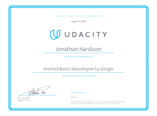

# Portfolio

Hello and welcome to my little portfolio of work. Below you'll find some education related projects, personal projects, and tinker-ville projects that I've worked on over time.

## Education: Udacity Grow with Google Challenge

* [Hello Android](https://github.com/jmhardison/udacity-andb-helloandroid)
* [Happy Birthday](https://github.com/jmhardison/udacity-andb-happybirthday)
* [Happy Coffee Break](https://github.com/jmhardison/udacity-andb-happycoffeebreak)
* [Court Counter](https://github.com/jmhardison/udacity-andb-courtcounter)
* [Cookies](https://github.com/jmhardison/udacity-andb-cookies)
* [Menu](https://github.com/jmhardison/udacity-andb-menu)
* [Just Java](https://github.com/jmhardison/udacity-andb-justjava)
* [Quiz App](https://github.com/jmhardison/udacity-andb-quizapp)

## Education: Udacity Android Basics Nanodegree (GwG Scholarship Winner)

* [Single Screen](https://github.com/jmhardison/andb_project_singlescreen)
* [Score Keeper](https://github.com/jmhardison/andb_project_scorekeeper)
* [Quiz App](https://github.com/jmhardison/andb_project_quizapp)
* [Musical Structure](https://github.com/jmhardison/andb_project_musicalstructure)
* [Tour Guide](https://github.com/jmhardison/andb_project_tourguide)
* [News App](https://github.com/jmhardison/andb_project_newsapp)
* [Inventory App](https://github.com/jmhardison/andb_project_inventoryapp)

[Android Basics Nanodegree Certificate](https://confirm.udacity.com/49XHYAUZ)

## Education: Introduction to GAME DESIGN, PROTOTYPING, and DEVELOPMENT

* Boids
  * [Repository](https://github.com/jmhardison/igdpd-boids)

* Apple Picker
  * [Repository](https://github.com/jmhardison/igdpd-applepicker)

## Side Projects and Tinkers

* [IsGame.Online](https://isgame.online)
  
  * A simple tromp through learning NodeJS, through the creation of an Amazon Alexa Skill.
  * Simple skill that checks the online status of select video games. For example, Secret World Legends.
  * [Repository](https://github.com/jmhardison/isgame-online-lambda)

* Azure KeyVault HSM XMLSigning
  * Example command line project for demonstrating signed XML documents using keys stored in Azure Key Vault HSM.
  * [Repository](https://github.com/jmhardison/Example-AzureKeyVaultHSM-XMLSigning)

* [Docker-Moodle Fork](https://hub.docker.com/r/jhardison/moodle/)
  * Forked from Jade Auer, and maintained after Jade deprecated her distribution.
  * Simple containerized moodle image using linked repositories and git repo monitoring to inact rebuilds.
  * [Repository](https://github.com/jmhardison/docker-moodle)

* [BracePlace.biz](https://www.braceplace.biz)
  * Website using community themes and JekyllRB for an orthadontist.
  * [Repository](https://github.com/jmhardison/braceplace-biz)

* [LuckyStrikeFarm.com](https://www.luckystrikefarm.com)
  * General blank JekyllRB site for a plot of property.
  * [Repository](https://github.com/jmhardison/luckystrikefarm-com)

* ADFS User Mapping API
  * ADFS User Mapping API backend for returning a UPN of input value. (Proof of Concept)
  * This tool was quickly put together to prove the concept of altering a user account that is entered into a username field in the ADFS portal authenticaiton, and transforming it into a different ID.
  * [Repository](https://github.com/jmhardison/adfsusermappingapi)

* Node App Lab Splat
  * Designed to consume Microsoft SQL and provide a few endpoints to point load generators at.
  * [Repository](https://github.com/jmhardison/nodeapplabsplat)

* F5 OTP User Email Mapping
  * This web service is used in a F5 ILX workflow to return an email address for a given user id.
  * [Repository](https://github.com/jmhardison/f5otpuseremailmapping)
  
* NodeVerify
  * This project is used to create generic CPU load in conjunction with a load generator. It was a basic app used in testing and validating container orchestrators.
  * Cross platform release with Azure Pipelines delivering both linux and windows containers to hub.docker.com.
  * [Repository](https://github.com/jmhardison/nodeverify)

## Certifications: New and Old

* `DCA` Docker Certified Associate (active) [Verify](https://credentials.docker.com/bo35ms0e)
* `MCSE` Microsoft Certified Systems Engineer on 2000, 2003 (Inactive)
* `MCSA` `Charter Member` Microsoft Certified Systems Administrator on 2003 (Inactive)
* `CCNA` Cisco Certified Network Associate (Inactive)
* `CCDA` Cisco Certified Design Associate (Inactive)
* `ACA` Avaya Certified Associate (Inactive)
* `CCEA` Citrix Certified Enterprise Administrator (Inactive)
