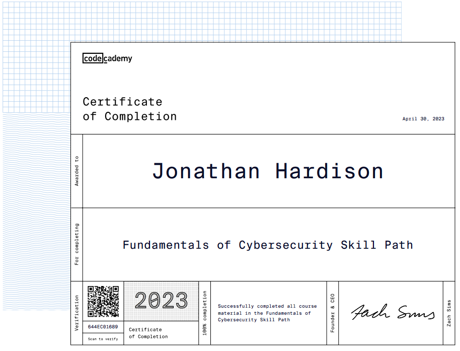
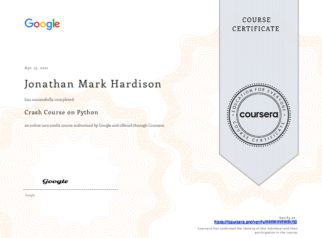

Hello and welcome to my little portfolio of work. Below you'll find some education related projects, personal projects, and tinker-ville projects that I've worked on over time.

# Certifications: New and Old

* `LE-1` Linux Essentials [Verify](https://lpi.org/v/LPI000255437/97f3uzxxrm) 
* `CKA` Certified Kubernetes Administrator [Verify](https://www.credly.com/badges/b4deb945-0da5-422c-8df6-fe5e68e22e6b/public_url)
* `MCA` Microsoft Certified: Azure Administrator Associate [Verify](https://learn.microsoft.com/en-us/users/jhardison/transcript/qde3c6n843e0zzv)
* `DCA` Docker Certified Associate (Inactive) [Verify](https://certification.mirantis.com/4cd80bbc-dff6-479a-baaf-a6fc96a0b9fa)
* `MCSE` Microsoft Certified Systems Engineer on 2000, 2003 (Inactive) [Verify](https://docs.microsoft.com/en-us/users/jhardison/transcript/qde3c6n843e0zzv?source=docs) (`1753103`)
* `MCSA` `Charter Member` Microsoft Certified Systems Administrator on 2003 (Inactive) [Verify](https://docs.microsoft.com/en-us/users/jhardison/transcript/qde3c6n843e0zzv?source=docs) (`1753103`)
* `CCNA` Cisco Certified Network Associate (Inactive) (`CSCO10414355`)
* `CCDA` Cisco Certified Design Associate (Inactive) (`CSCO10414355`)
* `ACA` Avaya Certified Associate (Inactive)
* `CCEA` Citrix Certified Enterprise Administrator (Inactive) (`CTX141469`)

# Education
The following is a rolling list of various bits and bobs of education. Some related, some fringe, all worth it.

## Codecademy - Fundamentals of Cybersecurity Skill Path

[Fundamentals of Cybersecurity Skill Path](https://coursera.org/verify/K4XWHVFWBLFQ)

## Coursera - Google Crash Course on Python

[Google Crash Course on Python](https://coursera.org/verify/K4XWHVFWBLFQ)

## Udacity Grow with Google Challenge

* [Hello Android](https://github.com/jmhardison/udacity-andb-helloandroid)
* [Happy Birthday](https://github.com/jmhardison/udacity-andb-happybirthday)
* [Happy Coffee Break](https://github.com/jmhardison/udacity-andb-happycoffeebreak)
* [Court Counter](https://github.com/jmhardison/udacity-andb-courtcounter)
* [Cookies](https://github.com/jmhardison/udacity-andb-cookies)
* [Menu](https://github.com/jmhardison/udacity-andb-menu)
* [Just Java](https://github.com/jmhardison/udacity-andb-justjava)
* [Quiz App](https://github.com/jmhardison/udacity-andb-quizapp)

## Udacity Android Basics Nanodegree (GwG Scholarship Winner)

* [Single Screen](https://github.com/jmhardison/andb_project_singlescreen)
* [Score Keeper](https://github.com/jmhardison/andb_project_scorekeeper)
* [Quiz App](https://github.com/jmhardison/andb_project_quizapp)
* [Musical Structure](https://github.com/jmhardison/andb_project_musicalstructure)
* [Tour Guide](https://github.com/jmhardison/andb_project_tourguide)
* [News App](https://github.com/jmhardison/andb_project_newsapp)
* [Inventory App](https://github.com/jmhardison/andb_project_inventoryapp)

[Android Basics Nanodegree Certificate](https://confirm.udacity.com/49XHYAUZ)

## Introduction to GAME DESIGN, PROTOTYPING, and DEVELOPMENT

* Boids
  * [Repository](https://gitlab.com/jmhardison/igdpd-boids)

* Apple Picker
  * [Repository](https://gitlab.com/jmhardison/igdpd-applepicker)

## Udemy Ultimate Guide to Game Development with Unity

* Galaxy Shooter
  * [Repository](https://gitlab.com/jmhardison/learning-galaxy-shooter)
  * [WebGL Game](https://www.jonathanhardison.com/learning-galaxy-shooter)

# Side Projects and Tinkers

* [HHOUSE-APPS](https://github.com/jmhardison/hhouse-apps)
  * This project combines use of Cloudflare Argo Tunnels, 1Password, ArgoCD, and GitHub Actions for access and deployment automation to K8S.
  * Deploys into a lab cluster, but useful to peruse for info and examples.
  * [Repository](https://github.com/jmhardison/hhouse-apps)

* [IsGame.Online](https://isgame.online)
  * A simple tromp through learning NodeJS, through the creation of an Amazon Alexa Skill.
  * Simple skill that checks the online status of select video games. For example, Secret World Legends.
  * [Repository](https://github.com/jmhardison/isgame-online-lambda)

* [Azure KeyVault HSM XMLSigning](https://github.com/jmhardison/Example-AzureKeyVaultHSM-XMLSigning)
  * Example command line project in C# for demonstrating signed XML documents using keys stored in Azure Key Vault HSM.
  * [Repository](https://github.com/jmhardison/Example-AzureKeyVaultHSM-XMLSigning)

* [Docker-Moodle Fork](https://hub.docker.com/r/jhardison/moodle/)
  * Forked from Jade Auer, and maintained after Jade deprecated her distribution.
  * Simple containerized moodle image using linked repositories and git repo monitoring to inact rebuilds.
  * [Repository](https://github.com/jmhardison/docker-moodle)

* [LuckyStrikeFarm.com](https://www.luckystrikefarm.com)
  * General blank JekyllRB site for a plot of property.
  * [Repository](https://github.com/jmhardison/luckystrikefarm-com)

* [ADFS User Mapping API](https://github.com/jmhardison/adfsusermappingapi)
  * ADFS User Mapping API backend for returning a UPN of input value. (Proof of Concept)
  * This tool was quickly put together to prove the concept of altering a user account that is entered into a username field in the ADFS portal authenticaiton, and transforming it into a different ID.
  * [Repository](https://github.com/jmhardison/adfsusermappingapi)

* [Node App Lab Splat](https://github.com/jmhardison/nodeapplabsplat)
  * Designed to consume Microsoft SQL and provide a few endpoints to point load generators at.
  * [Repository](https://github.com/jmhardison/nodeapplabsplat)

* [F5 OTP User Email Mapping](https://github.com/jmhardison/f5otpuseremailmapping)
  * This web service is used in a F5 ILX workflow to return an email address for a given user id.
  * [Repository](https://github.com/jmhardison/f5otpuseremailmapping)
  
* [NodeVerify](https://github.com/jmhardison/nodeverify)
  * This project is used to create generic CPU load in conjunction with a load generator. It was a basic app used in testing and validating container orchestrators.
  * Cross platform release with Azure Pipelines delivering both linux and windows containers to hub.docker.com.
  * [Repository](https://github.com/jmhardison/nodeverify)

